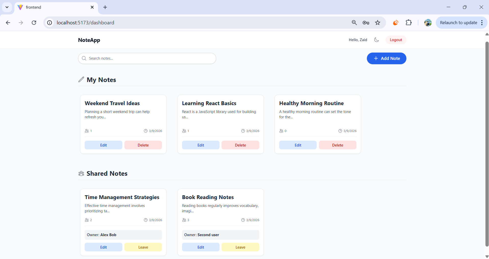
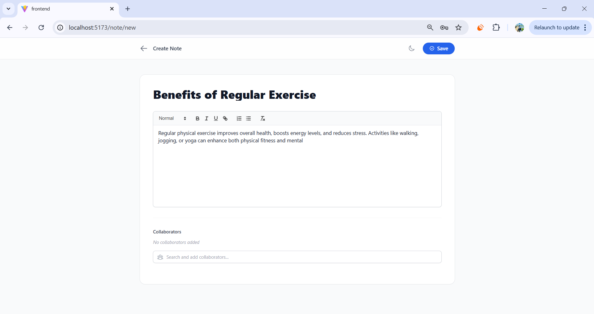

# Collaborative Note-Taking Web App

A robust, modern full-stack MERN (MongoDB, Express, React, Node.js) application built for the Agro Ventures Digital (Pvt) Ltd Software Engineering Intern technical assessment (Track C). 

This project is a collaborative Note-Taking application that allows users to create rich-text notes, add collaborators, and manage all of their notes in a single dashboard powered by a seamless, mobile-responsive Light/Dark mode UI.

## Overview

This application allows users to create, edit, search, and collaboratively manage rich-text notes. Users can add other registered users to collaborate on notes while maintaining strict access control.

The project demonstrates full-stack development skills including authentication, RESTful API design, state management, and modern responsive UI development.

## Project Structure

mern-note-app
│
├── backend
│   ├── controllers
│   ├── models
│   ├── routes
│   ├── middleware
│   └── server.js
│
├── frontend
│   ├── components
│   ├── pages
│   ├── context
│   └── main.jsx
│
├── README.md
│
└── screenshots

## Features
- **JWT Authentication:** Secure user registration, login, and session persistence via tokens and Protected Routes.
- **Collaborator Management:** Owners can add registered users to view and edit notes in real time.
- **Full-Text Search:** Users can search through their personal and shared notes via a seamless frontend search bar connected to a MongoDB `$text` search index.
- **Rich Text Editor:** Built-in React-Quill integration for robust formatting, styling, and text manipulation.
- **Tailwind CSS Styling:** A fully custom, responsive, and accessible UI that supports automatic and manual system Theme Toggling (Light/Dark mode).

## Tech Stack

**Frontend:**
- React (Vite)
- React Router DOM
- Tailwind CSS
- Axios
- React Quill (Rich Text)

**Backend:**
- Node.js & Express
- MongoDB & Mongoose
- JSON Web Tokens (JWT) & bcryptjs
- Cors & dotenv

## API Endpoints

### Auth
- `POST /api/auth/register`
- `POST /api/auth/login`

### Notes
- `GET /api/note`
- `POST /api/note`
- `GET /api/note/:id`
- `PATCH /api/note/:id`
- `DELETE /api/note/:id`

### Collaboration
- `POST /api/note/:id/collaborators`
- `PATCH /api/note/:id/leave`

### Search
- `GET /api/note/search?q=query`

### Users
- `GET /api/users`

## Setup Instructions

### 1. Clone the repository
```bash
git clone https://github.com/sheda3838/mern-note-app.git
cd mern-note-app
```

### 2. Environment Variables
You will need to set up `.env` files in both the `backend` and `frontend` directories. 

**Backend (`backend/.env`):**
Create the file using the provided `.env.example` template:
```env
PORT=5000
MONGO_URI=your_mongodb_connection_string
JWT_SECRET=your_jwt_secret
```

**Frontend (`frontend/.env`):**
Create the file using the provided `.env.example` template:
```env
VITE_API_URL=http://localhost:5000/api
```

### 3. Install Dependencies & Run

**Start the Backend:**
```bash
cd backend
npm install
npm run dev
```

**Start the Frontend:**
Open a new terminal window:
```bash
cd frontend
npm install
npm run dev
```

The application will now be running on `http://localhost:5173`.

## Reasonable Assumptions Made

During the development of this timeline-restricted assessment, the following assumptions were made to prioritize core functionality and architectural cleanliness:

1. **Email Verification:** There is no specific requirement for email verification. Upon completing the registration form, users are immediately activated and redirected to Login.
2. **Access Control:** Notes are purely private. A user can only see notes they have created (as the `owner`), or notes they have been explicitly invited to (as a `collaborator`).
3. **Privilege Escalation Prevention:** To prevent abuse, only the `owner` of a note is allowed to delete it or add new collaborators. Invited collaborators have Read/Update privileges, and the autonomy to "Leave" the note at any time, but they cannot delete the entire document for everyone else.
4. **Theme Tracking:** While Tailwind natively tracks the OS preferences (`media` strategy), manual control and persistency using `localStorage` was implemented to give users a smoother UX toggle button on the frontend without relying entirely on OS toggles.
5. **Real-time WebSockets:** To keep the project scope strictly within the bounds of a RESTful MERN stack pattern rather than diverging into a socket-based architecture, "collaboration" relies on standard HTTP fetching layers. Collaborative real-time visibility (like Google Docs cursors) was considered out-of-scope for the timeframe but remains the immediate next step for scaling.

## Future Improvements

- Real-time collaborative editing using WebSockets (Socket.io)
- Presence indicators showing active collaborators
- Role-based permissions for collaborators
- Note version history and recovery
- Drag-and-drop note organization

## Screenshots

### Dashboard


### Note Editor
